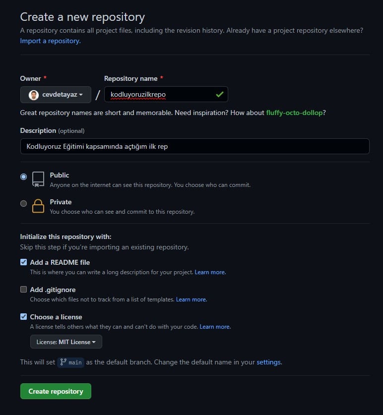

# Kodluyoruz Ilk Repo

Bu repo [Patika] (https://app.patika.dev/egitimler) Front-End Eğitiminde oluşturduğumuz ilk repo. İçerisinde bir adet READMe dosyası, bir adet de index.html barındırıyor.



# Installation

Öncellikle projeyi clonelayın. (Buraya sizin reponuzdan aldığınız link gelecek)
```bash
git clone https://github.com/cevdetayaz/kodluyoruzilkrepo.git
```

# Usage

Projeyi cloneladıktan sonra Visual Studio Code programında açınız.

Linux için

```linux
cd kodluyoruzilkrepo
code .
```

# Contributing
Pull requestler kabul edilir. Büyük değişiklikler için, lütfen önce neyi değiştirmek istediğinizi tartışmak için bir konu açınız.

# License

[MIT](LICENSE)